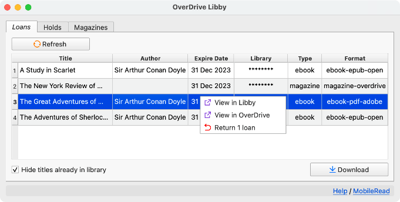
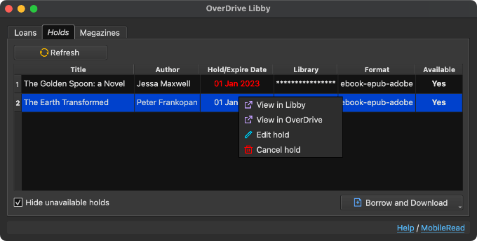
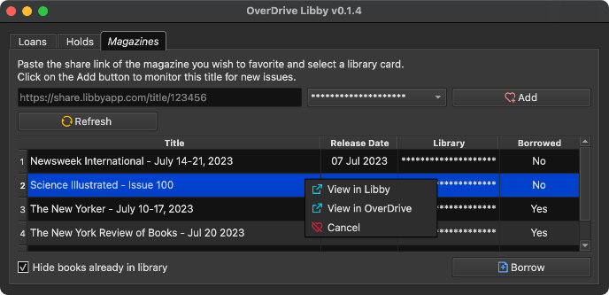

#  OverDrive Libby Plugin for calibre

OverDrive Libby is a plugin that allows you to directly import your Libby loans into [calibre](https://calibre-ebook.com/).

Requires calibre 6.

## Main Features

- Import the `.acsm` file for EPUB/PDF(DRM) book loans (see issue below)
- Import the `.epub` file for EPUB (open) book loans
- Import the `.epub` file for Magazines loans \[EXPERIMENTAL\]
- View and borrow holds
- Monitor magazines for new issues

This plugin is compatible with the [ACSM Input plugin](https://github.com/Leseratte10/acsm-calibre-plugin/) for converting `.acsm` files into `.epub`.

Also integrates with the [OverDrive Link plugin](https://www.mobileread.com/forums/showthread.php?t=187919). If an existing book has a matching OverDrive link and no formats, the loan download will be added to the book.

## Install

Open Preferences > Plugins > Get new plugins, and install the "OverDrive Libby" User interface action plugin.

You may also download the latest plugin zip file from Releases and install the plugin manually, then restart calibre as described in the [Introduction to Plugins](https://www.mobileread.com/forums/showthread.php?t=118680) thread.

To try out unreleased versions, go to [GitHub Actions](https://github.com/ping/libby-calibre-plugin/actions?query=branch%3Amain), and click on the latest run. The downloadable artifact, e.g. `overdrive-libby-plugin-1a2b3c4` will be an installable plugin zip.

## Setup

To configure this plugin, you must already be using Libby on a [compatible](https://help.libbyapp.com/en-us/6105.htm) device.

Open the plugin customisation settings (Preferences > Advanced: Plugins > Search for "overdrive libby" and then click on the "Customize plugin" button).

Get a Libby setup code by following the instructions [here](https://help.libbyapp.com/en-us/6070.htm). Enter the 8-digit code into the plugin settings and click "OK". If you encounter an error, the code may have expired. Get a new one and try again.

You should only need to do this setup once. Then add the plugin to the toolbar/menubar as you wish.

### Help

- Tag downloaded ebooks with
  - Add specified tags to the ebooks downloaded
- Tag downloaded magazines with
  - Add specified tags to the magazines downloaded
- Hide Ebooks
  - Don't list ebook loans
- Hide Magazines
  - Don't list magazine loans
- Prefer Open Formats
  - Choose DRM-free formats if available
- Hide books already in library
  - Hide loans that are already in your library
- Hide unavailable holds
  - Hide holds that are not yet available
- Always confirm returns
  - Toggle the confirmation prompt before returning loans
- Always confim holds cancellation
  - Toggle the confirmation prompt before cancelling a hold
- Enable OverDrive Link Plugin integration
  - Enable or disable the integration

## Usage

### Loans

Launch the OverDrive Libby plugin, and click on the "Loans" tab. Select the loans you wish to download, then click on the "Download" button.

Each selected loan will then be downloaded in its own calibre job. When the job completes, the loan book file should be in your library.

Only downloadable loans will be listed. If the loan does not have a downloadable format, or has previously been sent to your Kindle, it will not be shown.

To return a loan or to view the title on the Libby/OverDrive site, select and right-click on the row, then select the appropriate action.

### Holds

Select the "Holds" tab. Select the available hold you wish to borrow, then click on the Borrow button.

Each selected hold will then be borrowed in its own job. When the job completes, click the "Refresh" button to see the new loan in the "Loans" tab.

To list unavailable holds, uncheck the "Hide unavailable holds" checkbox.

To cancel a hold, select and right-click on the row, then select "Cancel hold".

### Magazines

Select the "Magazines" tab. From this tab, you can add magazines to monitor for new issues.

From the Libby/OverDrive site, copy the URL of the magazine you want to monitor. Paste the URL into the textbox, and select the Card to use for future borrowing. Then click on the "Add" button.

The title will then be listed below with its details. To borrow a title, select the row and click on the Borrow button.

To stop monitoring a title, select and right-click on the row, then select "Cancel".

## Credit

- Icons from https://remixicon.com/

## Disclaimer

This is not affliated, endorsed or certified by OverDrive. To use this plugin, you must already have access to OverDrive services via a valid library account. Use at your own risk.
