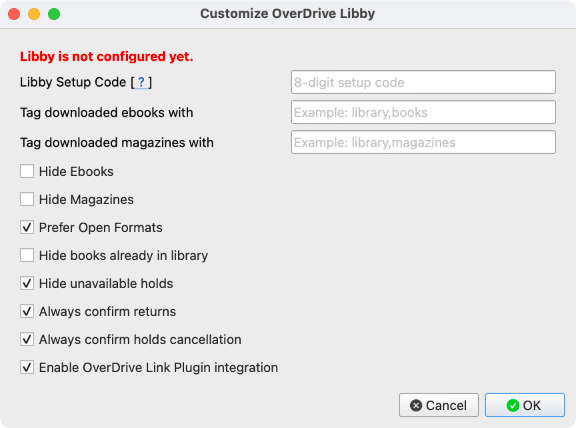
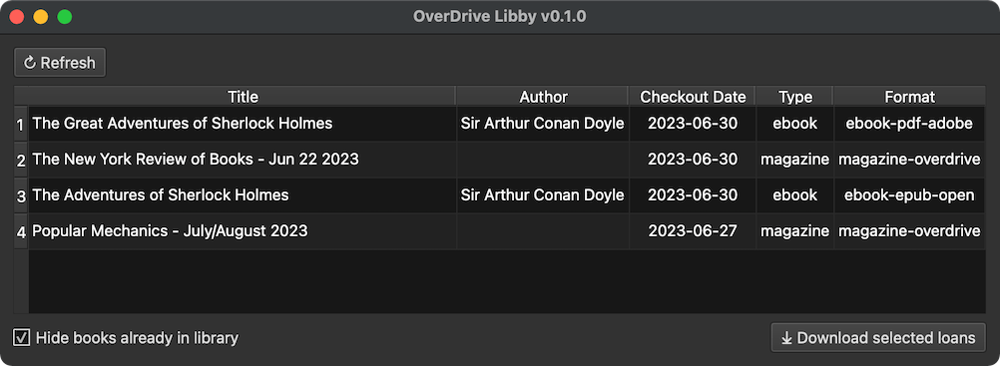

# OverDrive Libby Plugin for calibre

OverDrive Libby is a plugin that allows you to directly import your Libby loans into [calibre](https://calibre-ebook.com/).

## Main Features

- Import the `.acsm` file for EPUB/PDF(DRM) book loans (see issue below)
- Import the `.epub` file for EPUB (open) book loans
- Import the `.epub` file for Magazines loans \[EXPERIMENTAL\]

## Known Issues

- `.acsm` files imported into calibre results in epubs that do not have calibre metadata. See [bug#2025355](https://bugs.launchpad.net/calibre/+bug/2025355).

## Setup

Down the latest plugin zip file from Releases and [install in calibre](https://www.mobileread.com/forums/showthread.php?t=118680), then open the plugin settings.

To configure this plugin, you must already be using Libby on a [compatible](https://help.libbyapp.com/en-us/6105.htm) device.

You will need to get a Libby setup code by following the instructions [here](https://help.libbyapp.com/en-us/6070.htm). Enter the code into the plugin settings and click "OK". If you encounter an error, the code may have expired. Get a new one and try again.

You should only need to do this setup once. Then add the plugin to the toolbar/menubar as you wish.

### Help

- Hide Magazines: Don't list magazine loans
- Hide Ebooks: Don't list ebook loans
- Prefer Open Formats: Choose DRM-free formats if available
- Hide books already in library: Hide loans that are already in your library
- Verbose Logs: Enable more verbose logging for debugging

## Usage

Launch the OverDrive Libby plugin UI and select the loans you wish to download. Then click on the Download button.

Each selected loan will then be downloaded in its own calibre job. When the job completes, the loan book file should be in your library.

Only downloadable loans will be listed. If the loan does not have a downloadable format, or has previously been sent to your Kindle, it will not be displayed.
