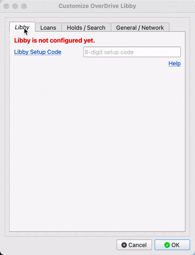
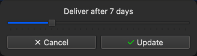
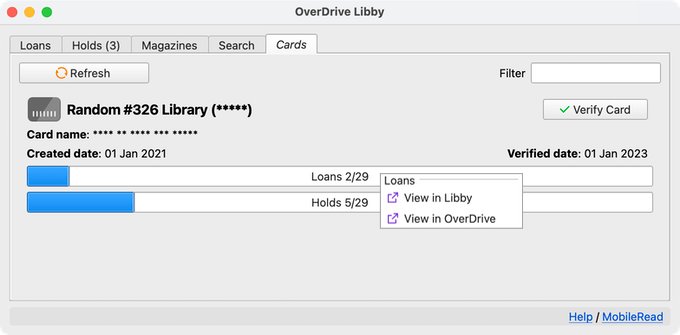

#  OverDrive Libby Plugin for calibre

OverDrive Libby is a plugin that allows you to directly import your Libby loans into [calibre](https://calibre-ebook.com/).

Requires calibre 5.34.0 or newer.

## Main Features

- Import the `.acsm` file for EPUB/PDF(DRM) book loans
- Import the `.epub`/`pdf` file for EPUB/PDF (open) book loans
- Import the `.epub` file for Magazines loans \[EXPERIMENTAL\]
- Import Kindle / audiobook loans as empty books
- View and borrow holds
- Monitor magazines for new issues
- Simple search across your linked libraries

This plugin is compatible with the [ACSM Input plugin](https://github.com/Leseratte10/acsm-calibre-plugin/) for converting `.acsm` files into `.epub`.

Also integrates with the [OverDrive Link plugin](https://www.mobileread.com/forums/showthread.php?t=187919). If an existing book has a matching OverDrive link and no formats, the loan download will be added to the book.

## Install

Open Preferences > Plugins > Get new plugins, and install the "OverDrive Libby" User interface action plugin.

You may also download the latest plugin zip file from Releases and install the plugin manually, then restart calibre as described in the [Introduction to Plugins](https://www.mobileread.com/forums/showthread.php?t=118680) thread.

To try out unreleased versions, go to [GitHub Actions](https://github.com/ping/libby-calibre-plugin/actions?query=branch%3Amain), and click on the latest run. The downloadable artifact, e.g. `overdrive-libby-plugin-1a2b3c4` will be an installable plugin zip. You will need to be logged in to GitHub to download artifacts.

## Setup

To configure this plugin, you must already be using Libby on a [compatible](https://help.libbyapp.com/en-us/6105.htm) device.

Open the plugin customization settings (Preferences > Advanced: Plugins > Search for "overdrive libby" and then click on the "Customize plugin" button).

Get a Libby setup code by following the instructions [here](https://help.libbyapp.com/en-us/6070.htm). Enter the 8-digit code into the plugin settings and click "OK". If you encounter an error, the code may have expired. Get a new one and try again.

You should only need to do this setup once. Then add the plugin to the toolbar/menubar as you wish.

### Help

#### Loans

- Hide Ebooks
  - Don't list ebook loans
- Hide Magazines
  - Don't list magazine loans
- Hide books already in library
  - Hide loans that are already in your library
- Exclude empty books when hiding titles already in library
  - When enabled, empty books are excluded when hiding titles already in your library
- Always confirm returns
  - Toggle the confirmation prompt before returning loans
- Always confirm Read with Kindle
  - Toggle the confirmation prompt before chosing to Read with Kindle a title that is not format-locked
- Prefer Open Formats
  - Choose DRM-free formats if available
- Enable OverDrive Link Plugin integration
  - Enable or disable the integration. If enabled, the plugin will attempt to find a matching OverDrive-linked book that does not have any formats and add the new download as an EPUB to the book record. Newly downloaded books will also have the `odid` identifier added.
- Mark updated books
  - This relates to empty books that are updated with a download by the plugin. If enabled, book records that were updated with a new format will be marked.
- Always download as a new book
  - Never update an existing empty book. Always create a new book entry for a download.
- Tag downloaded ebooks with
  - Add specified tags to the ebooks downloaded
- Tag downloaded magazines with
  - Add specified tags to the magazines downloaded
- Custom column for Borrowed Date
  - If specified, this column will be updated with the loan checkout date
- Custom column for Due Date
  - If specified, this column will be updated with the loan expiry date
- Custom column for Loan Type
  - If specified, this column will be updated with the loan type, e.g. ebook / magazine / audiobook.

#### Holds

- Hide unavailable holds
  - Hide holds that are not yet available
- Always confim holds cancellation
  - Toggle the confirmation prompt before cancelling a hold

#### Search

- Maximum search results
  - Limit the number of search results returned
- Library Keys
  - This determines the libraries that will be used for search.
  - Up to 24 of your linked cards will be used. If you have more than 24, you can specify the libraries to use by specifying the library keys in a comma-separated format.

#### General

- Disable Magazines tab
  - Don't display the Magazines tab in the plugin window
- Include titles without downloadable formats
  - When enabled, titles that do not have a downloadable format will be shown
  - When such titles are chosen for download, an empty book will be created in the calibre library
- Use highest-resolution cover for book details
  - Display best-quality cover when viewing book details. May be slower.
- Cache data for
  - Infrequently changed data like libraries information are cached by the plugin. Use this to change how long cached data is used.

#### Network

- Connection timeout
  - The maximum interval to wait on a connection. You can increase this value if you have a slow connection.
- Retry attempts
  - The number of retries upon connection failures

## Usage

### Loans

Launch the OverDrive Libby plugin, and click on the "Loans" tab. Select the loans you wish to download, then click on the "Download" button.

Each selected loan will then be downloaded in its own calibre job. When the job completes, the loan book file should be in your library.

Only downloadable loans will be listed. If the loan does not have a downloadable format, or has previously been sent to your Kindle, it will not be shown unless "Include titles without downloadable formats" is enabled in setup.

Select a row, right-click and select the appropriate action to:
- Return a loan
- View the title on the Libby/OverDrive site
- Read with Kindle (if available)
- View book details (also accesible by double-clicking on the row)
- Copy the Libby share link
- Search for selected book in your calibre library
- Search with the selected book title and author
- Renew/place a hold for an expiring loan

#### Format Locking

Libby does not allow users to read a loan on a Kindle and still download the title as an `.acsm`/`.epub`.

If you chose to read with a Kindle, the loan will not be available for download (the loan is locked to the Kindle format). Similarly, if you chose to download the `.acsm`/`.epub`, the loan becomes locked to the acsm/epub format and will not be available for reading on a Kindle.

Removing a book from the Kindle/ADE/calibre does not "unlock" the loan. To do that, you have to return and borrow the book again.

### Holds

Select the "Holds" tab. Select the available hold you wish to borrow, then click on the Borrow button.

Each selected hold will then be borrowed in its own job. When the job completes, click the "Refresh" button to see the new loan in the "Loans" tab.

Alternatively, right-click on the Borrow button to choose the "Borrow and Download" action. This will borrow and download the selected hold.

To list unavailable holds, uncheck the "Hide unavailable holds" checkbox.

Select a row, right-click and select the appropriate action to:
- Cancel a hold
- Suspend/delay delivery for a hold ("Manage hold")

### Magazines

Select the "Magazines" tab. From this tab, you can add magazines to monitor for new issues.

From the Libby/OverDrive site, copy the URL of the magazine you want to monitor. Paste the URL into the textbox, and select the Card to use for future borrowing. Then click on the "Add" button.

The title will then be listed below with its details. To borrow a title, select the row and click on the Borrow button.

To stop monitoring a title, select and right-click on the row, then select "Cancel".

### Search

The "Search" tab provides a basic search function across your libraries. The libraries to search and the number of results returned can be customised in setup. To borrow or place a hold, select a title, then click on the Hold or Borrow button and select the card you wish to use.

### Cards

The "Cards" tab provides an overview of the linked cards in your Libby account. Right-click on the Library name, Loans, or Holds to view the respective pages on OverDrive or Libby.

## FAQ

### `[SSL: CERTIFICATE_VERIFY_FAILED] certificate verify failed` error on Windows

Download the Let's Encrypt R3 certificate https://letsencrypt.org/certs/lets-encrypt-r3.der. Import it into the Windows certificate store by double-clicking on the file and follow the subsequent prompts.

### Why can't I see my all loans?

If you wish to see loans that are not fully downloadable (e.g. Kindle loans, audibooks), enable the "Include titles without downloadable formats" option in setup.

### Why is a loan downloaded without any formats (acsm/epub)?

This is because the loan does not have a supported downloadable format available. The loan is either not available in epub/pdf, or you have chosen to Read with Kindle (see above for details about [Format Locking](#format-locking)).

### Why can't I download a particular magazine?

Not all magazines are downloadable. Only magazines that have [readable individual articles](https://help.libbyapp.com/en-us/6215.htm) can be downloaded.

## Credit

- Icons from https://remixicon.com/ and https://tabler-icons.io/

## Disclaimer

This is not affliated, endorsed or certified by OverDrive. To use this plugin, you must already have access to OverDrive services via a valid library account. Use at your own risk.
